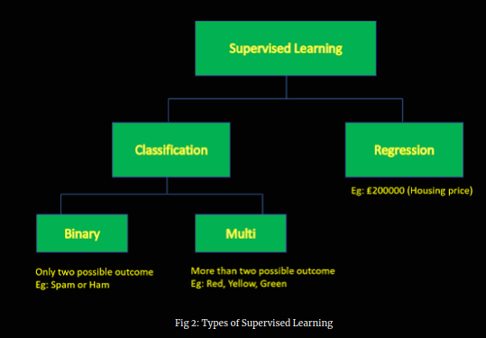

# Machine Learning Algorithms

What is machine learning (ML)? How many different types of ML algorithms are there? In this post, we will discover the definition of machine learning, different types of machine learning algorithms such as supervised, unsupervised, semi-supervised, reinforcement learning, and real-world applications.

The term 'Machine Learning' has become a buzz in today's world. The term was coined by Arthur Samuel in 1959 and he defined it as:
> *It is the field of study that gives computers the ability to learn without being explicitly programmed*

A common example of an ML application is an email spam filter. If we venture to build a spam filter based on simple 'if-then' rules, i.e. filter out emails with words "terror", "shooting" etc., it is very unlikely to be a robust application. The spammers could easily update their messages to override existing 'if-then' rules. However, if we build a spam filter which continuously learns from words in the email, metadata and personal preferences etc., it results in a much better application. Gmail is [99.9% successful in filtering spam](https://gmail.googleblog.com/2015/07/the-mail-you-want-not-spam-you-dont.html) by adopting ML algorithms.

Machine learning algorithms can be broadly classified into 4 major categories namely supervised learning, unsupervised learning, semi-supervised learning and reinforcement learning. Let's have a brief look at each category.

## 1. Supervised Learning

In supervised learning, the system is fed with sample inputs (a.k.a 'training data') along with its desired outcome (a.k.a 'labels'). Consider our previous example of an email spam filter. The system is fed with sample emails (training data) along with their class (labels) i.e. spam or ham, and the system learns to classify new emails (See below figure).

Supervised learning techniques can be further divided into 2 types (Figure 2):

- Classification - The email spam filter is an example of a classification problem. The system classifies a new email as Spam or Ham. Depending on the number of possible classification, it can be further sub-divided into the binary or multi-classification problem.

- Regression - The task is to predict a target numeric value such as the housing price given certain features like roof material, the shape of the property, type of road access etc. The system is trained by feeding several features of the house (roof material etc.) along with prices of the house (labels).

Some other applications of supervised learning are:

* Fraud detection - detecting fraudulent transactions
* Image Classification - classifying objects/animals in the image
* Sentiment Analysis - classifying the tone of the text such as positive, neutral, negative etc.
* Score prediction - predicting housing prices

Some of the important ML supervised learning algorithms are given below:

*   Logistic Regression
*   Linear Regression
*   k-Nearest Neighbors
*   Random Forests
*   Decision Trees
*   Support Vector Machines (SVM)

## 2. Unsupervised Learning

In unsupervised learning, the system is fed with training data without labels. The system tries to learn the patterns from the training data alone. The term "unsupervised" means that the learning process is not guided as in supervised learning.

Unsupervised learning algorithms can be broadly categorised into three:

*    Clustering -  The clustering algorithm explores the training data (input data) and identifies any underlying pattern.

* Dimensionality reduction - The aim of the algorithm is to simplify the training data without losing vital information. Dimensionality reduction helps to reduce the complexity of the training data while maintaining the relevant information to an extent.

* Association rule - It is aimed at discovering the interesting relationships between objects. For instance, running an association rule on the sales logs from one of the supermarkets may reveal that customers who buy cola and chicken often buy chips. Then, the manager may want to keep those items close to each other.

Some important real-world applications of unsupervised learning are:

*    Medical imaging - to discover different types of tissues
*    Recommendation systems - provide better purchase suggestions to Amazon customers
*    Anomaly detection - to identify suspicious online activity
*    Pattern recognition - grouping images 

Some of the important unsupervised learning algorithms are given below:

*    Clustering
        - k-Means
        - Hierarchical Cluster Analysis (HCA)
        - Expectation Maximisation (EM)
*    Dimensionality reduction
        - Principal Component Analysis (PCA)
        - Kernel PCA
*    Association rule
        - Equivalence Class Clustering and bottom-up lattice traversal (Eclat)
        - Apriori

## 3. Semi-Supervised Learning

As you might have guessed by its name, semi-supervised is a mixture of the supervised and unsupervised learning algorithm. Typically, this combination contains a very small amount of labelled data and a very large amount of unlabelled data.

[Google cloud AI workshop](https://cloud.google.com/ai-workshop/experiments/labeling-images-with-semi-supervised-learning) announced an experiment where user can label hundreds of thousands of images using semi-supervised learning. The user has to provide very few labelled images (as low as 5 images per class) and can receive back labels for a whole large amount of unlabelled data.
Some other real-world applications of semi-supervised learning are:

* Speech analysis - labelling of audio files
* Webpage ranking- to rank the relevance of webpage for a given user query

## 4. Reinforcement Learning

Reinforcement learning (RL) is altogether different from all the previous learning algorithms. It is similar to a father teaching his child ('agent' in RL) to walk for the first time. Whenever the child takes a few steps ('actions' in RL), the father appreciates his child by either clapping hands or giving the child's favourite candy ('rewards' in RL). Whenever his child makes mistakes or falls down, the father may not clap his hands or not give favourite candy ('penalty' in RL). By this sequence of actions, the child tries to maximise the chance of getting candy or appreciation by trying to walk properly. The child then learns by self the best strategy ('policy' in RL) to walk properly.

Few examples of the real-world applications of reinforcement learning are:

*    Industry automation - Use of AI agents by Deepmind to cool Google data centers, leading to a 40% reduction in energy spending
*    Text Mining - Used in text summarising, question answering (Q&A), machine translation etc.
*    Gaming - 'AlphaGo' program trained by RL, defeated the 'Go' world champion Ke Jie in 2017.

Examples of reinforcement learning algorithms are:

*    Q-learning
*    State-Action-Reward-State-Action (SARSA)
*    Deep Q-network
*    Monte Carlo
*    Proximal Policy Optimization (PPO)

## Summary

In this blog, you discovered what is meant by machine learning and some of its real-world applications. You also explored various machine learning techniques and their application briefly.

Have you got any questions? Please get in touch with me. I would love to hear from you.

