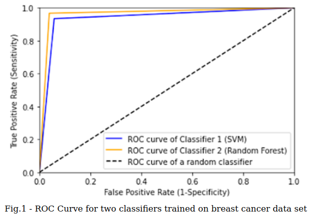
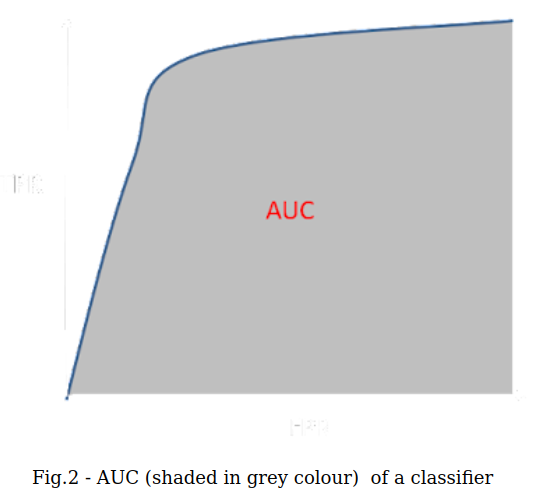

In this second part of the 'Classification Metrics' series, we will look at two different classification metrics - ROC Curve & AUC. If you want to know about other classification metrics used, refer to previous blog [Classification Metrics - Part 1](https://arungrace88.github.io/ClassificationMetric-1/).

# ROC Curve

The term ROC stands for 'Receiver Operating Characteristic'. ROC curve is used to measure the performance of a classifier at various classification thresholds. It primarily plots two parameters -

<ol>
  <li>True Positive Rate, TPR (a.k.a Sensitivity, Recall)</li>
  <li>False Positive Rate, FPR (a.k.a 1-Specifcity). Specificity is otherwise known as 'True Negative Rate'.</li>
</ol>

The figure 1 shows ROC curve for two classifiers trained on breast cancer data set.

If you want to revisit the concepts of Sensitivity and Specificity, refer to the previous blog [Confusion Matrix - Is it really confusing?](https://arungrace88.github.io/Confusion-Matrix/).

## Classification Thresholds

We heard that ROC curve is a graphical measure of performance of a classifier at various classification thresholds. What does that mean?. Well, many of the classification algorithms such as logistic regression outputs the probability of a data input to fall under either one of the output categories (eg: benign or malignant) rather than the category itself. In such cases, the algorithm decides that a particular data input belongs to a certain category when the predicted probability exceeds a threshold value - usually by default it is 0.5. 

However, the threshold value can be lowered or raised as per the user/business requirement. There could be a possibility that a classifier performs better when threshold is changed to a value other than 0.5. Checking for the best threshold for a classifier manually is not only time consuming but sometimes not practical.

## Back to ROC Curve

It is interesting to know little history behind the usage of ROC. In 1940, soon after the attack in Pearl Harbor, ROC curves were used by US in their research to determine how US radar "receiver operators" missed the Japanese aircraft [1].

The desirable goal of any classifier is to maximise TPR and minimise FPR. As ROC curve plots TPR and FPR at various thresholds, it gives valuable insight into the threshold value where the classifier performs better.

The ROC curve of a classifier which predicts randomly (no intelligence at all !) is shown as black dotted diagonal line (45 degree) in figure 1. **The better the classifier, the further the curve move towards left from the diagonal line and vice-versa**. In fig.1, looking at the ROC curve for the classifiers 1 & 2, we can say that classifier 2 (Random forest algorithm) is slightly out performing classifier 1 on test data from breast cancer data set.

## Practical Application

* In medical field, ROC curve is used to ascertain how much better a continous predictor (such as 'biomarker') can predict the status of the disease than a random choice.
* ROC curves are extensively used in epidemiology
* ROC is a common technique to evaluate new radiation techniques
* It is used in verification of forecasts in meteorology [2]

Now, this brings us to another classification metric - AUC.

# AUC - Area Under the ROC Curve 

In simplest terms, AUC is the area under the ROC curve. AUC gives combined measure of performance of a classifier across all possible thresholds. AUC ranges in the value from 0 to 1. A classifier which  makes 100% correct predictions will have AUC of 1.0 and a classifier which doesn't make any correct predictions will have AUC of 0.0.

The AUC score for two classifiers - 1 & 2 as shown in figure 1 are 0.938 and 0.964 respectively. You can find the Python 3 code used to generate the ROC curve and AUC for classifiers 1 & 2 at [Github](https://github.com/arungrace88/AI_Blog/tree/master/Classification%20Metrics).

Two big advantages of using AUC are:

<ol>
  <li> It is scale-invariant. It gives insight on how well predictions are ranked rather than their actual values.</li>
  <li> It is threshold-independent. It measures the performance of the classifier irrespective of the threshold value taken into consideration.</li>
</ol>

# Summary

In this post, we discussed 2 different types of classification metrics used for classification problems in machine learning. More about other metrics used in machine learning will be discussed in the coming posts.

Have you got any questions or feedback? I would love to hear from you.

# References

[1]. Acutecaretesting.org. 2020. ROC Curves – What Are They And How Are They Used?. [online] Available at: <https://acutecaretesting.org/en/articles/roc-curves-what-are-they-and-how-are-they-used> [Accessed 16 October 2020].

[2]. En.wikipedia.org. 2020. Receiver Operating Characteristic. [online] Available at: <https://en.wikipedia.org/wiki/Receiver_operating_characteristic> [Accessed 16 October 2020]. 

