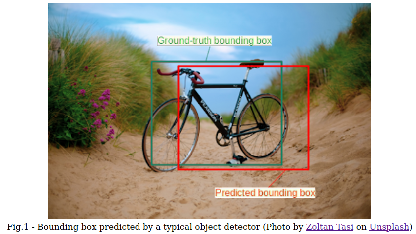
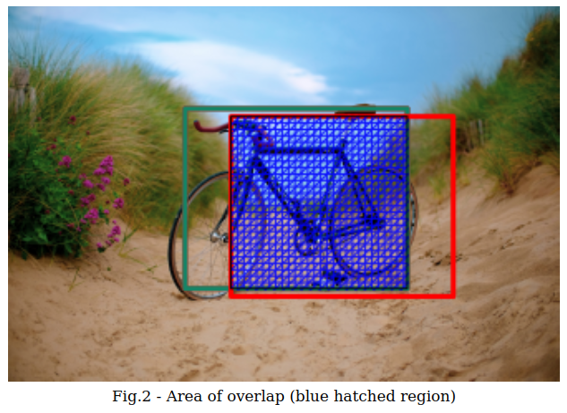
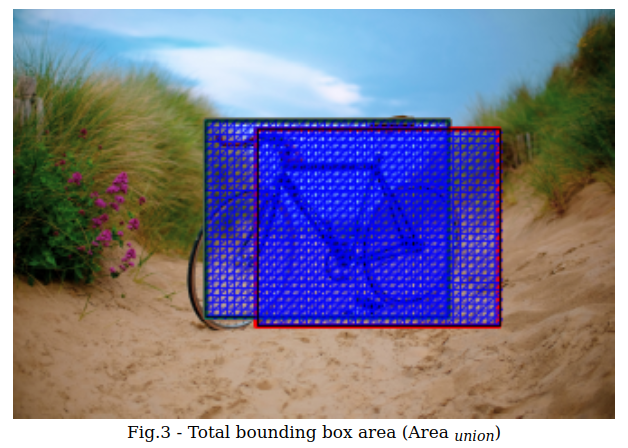
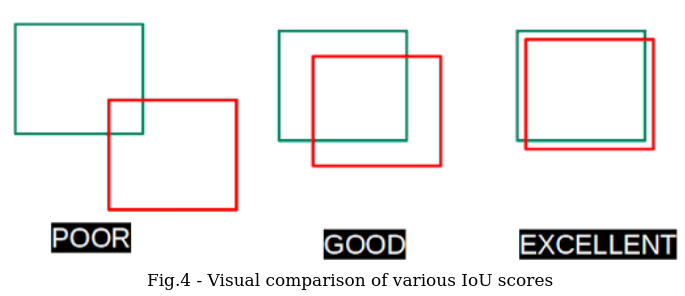

In this blog, we will discuss an evaluation metric commonly used in the computer vision object detection problem - Intersection over Union (IoU). If you want to know more about evaluation metrics used in classification problems in machine learning, please refer to my previous blog - [Classification Metrics](https://arungrace88.github.io/ClassificationMetric-1/).

# Object Detection

Object detection is a computer vision technique to identify and locate objects in an image or a video. This technique could be used to count the number of objects in an image, track an object in a scene, etc. Irrespective of the machine learning technique used to implement object detection by predicting bounding boxes, it is evaluated using a metric known as Intersection over Union commonly abbreviated as IoU.

To evaluate any object detector, we need:

<ol>
  <li>Predicted bounding box - The output from an object detector in the form of a bounding box (set of x,y coordinates)</li>
  <li>Ground-truth bounding box - The labelled bounding box (set of x,y coordinates) from the data set indicating where exactly the object is in the image.</li>
</ol>

The figure 1 below shows the predicted bounding box (red rectangle) and the ground-truth bounding box (green rectangle) for a bicycle in the image.

IoU is defined as:

IoU = Areaoverlap &divide; Areaunion

such that

IoU = Areaoverlap &divide; Areaunion

 0 &#8804; IoU &#8804; 1 

where Areaoverlap is shown in figure 2 (blue hatch).

Areaunion is shown in figure 3.

More the area of overlap, better the object detector. An IoU score > 0.5 is considered as a "good" prediction. Figure 4 shows a visual comparison of a poor, good and excellent IoU scores.

# Summary

In this post, we discussed about commonly used evaluation metric in object detection problems - Intersection over Union. Stay tuned for a python implementation of a custom object detector.

Have you got any questions or feedback? I would love to hear from you.

