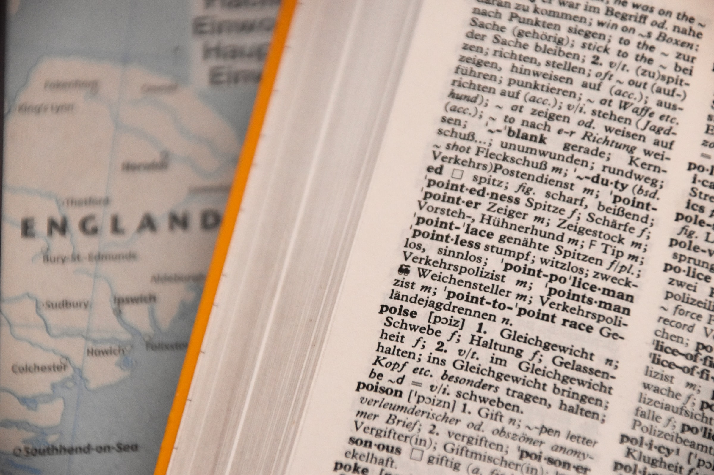

In this article, we will look into a NLP metric which is commonly used in Machine Translation (MT) applications - BLEU, an acronym for BiLingual Evaluation Understudy. 

# BLEU Score

The idea behind the BLEU score is to check how close a machine translated text is to a human translation. Better the score, closer resemblance to human translation. Let us explore more about this by considering an example given below.

## Example

Machine translation (a.k.a Candidate) = "the cat and the cat on the mat"

Reference translation 1: "The cat is on the mat"

Reference translation 2: "There is a cat on the mat"

The BLEU score is calculated as:

BLEU = BP &times; exp(&sum;n=1...N wn&times; ln(pn)

where,

pn is the modified precision for n-gram (will discuss this shortly)

wn is the weight (value between 0 and 1) such that 

&sum;n=1...N wn = 1

BP is the brevity penalty to penalise short machine translations. It is calculated as:

BP = 1, when c&gt;r

BP = e1-(r&divide;c), when c&le;r

where,

'c' is the length of candidate sentence

'r' is the effective reference corpus length. In other words, it is the closest reference sentence length to the candidate sentence.

## Modified Precision

The concept of modified precision can be best explained with an example of 1-gram (n=1) unique words from our above example. The list of unique 1-gram (unigram)words from our candidate sentence are:

 ( the, cat, and, on, mat)

The list of unique 2-gram (bigram) words from our candidate sentence are:

(the cat, cat and, and the, cat on, on the, the mat)

and so on for 3-gram, 4-gram, etc.

The Table 1 shows the unique unigram and its corresponding count in the candidate sentence. The third column is the clipped count which is defined as the maximum frequency of the unqiue unigram in the reference translations (either 1 or 2).

Table1:Unique Unigram Example

|Unique Unigram|Count|Clipped Count|
|--------------|-----|-------------|
|the           | 3   |    2        |
|cat           | 2   |    1        |
|and           | 1   |    0        |
|on            | 1   |    1        |
|mat           | 1   |    1        |

The total clipped counts for the unique unigram in reference sentence is 5 (2+1+0+1+1). The total number of counts of unique unigram in candidate sentence is 8 (3+2+1+1+1). The modified precision is then calculated as:

Modified Precision = Total Clipped Count &divide; Total Count

= 5&divide;8

= 0.625

On a similar line, modified precision for unique bigram can be calculated. Give a try!

## BLEU Score Calculation

Usually BLEU takes N=4 and wn =1/N. For the above example we could find that

p1 = 5 &divide;8

p2 = 4 &divide;7

p3 = 2 &divide;6

p4 = 1 &divide;5

w1 = w2 = w3 = w4 = 1 &divide;4

c = 8

r = 7

Hence, BP = 1

When we substitute above values into the BLEU equation, we get a score of 0.3928. Please try from your side!.

Let us check whether our manual calculation is correct by comparing it with BLEU score calculated using 'nltk' python library.

    # Import the library
    import nltk
    # Reference translation 1
    ref_1 = "the cat is on the mat".split()
    # Reference translation 2
    ref_2 = "there is a cat on the mat".split()
    # Candidate translation a.k.a Machine translation
    candidate = "the cat and the cat on the mat".split()
    # Calculate BLEU Score
    bleu = nltk.translate.bleu_score.sentence_bleu(references=[ref_1,ref_2],hypothesis=candidate, weights=(0.25, 0.25, 0.25, 0.25))
    print("The BLEU score for the machine translated candidate sentence is:", bleu)

The above code outputs the BLEU score as 0.392814650900513. Our manual score match with the score returned from the python `nltk` library.

## Summary

In this post we discussed about a NLP metric used in machine translation - BLEU score. If you are interested in diving deep into more details of BLEU score, refer to the original research paper [BLEU: a Method for Automatic Evaluation of Machine Translation](https://www.aclweb.org/anthology/P02-1040.pdf).

Hope you learned something. Please do let me know your feedback or suggestions!

## Bibliography
[1]. [Lei Mao's Blog](https://leimao.github.io/blog/BLEU-Score/)

[2]. Papineni, K., Roukos, S., Ward, T. and Zhu, W.J., 2002, July. BLEU: a method for automatic evaluation of machine translation. In Proceedings of the 40th annual meeting of the Association for Computational Linguistics (pp. 311-318).

