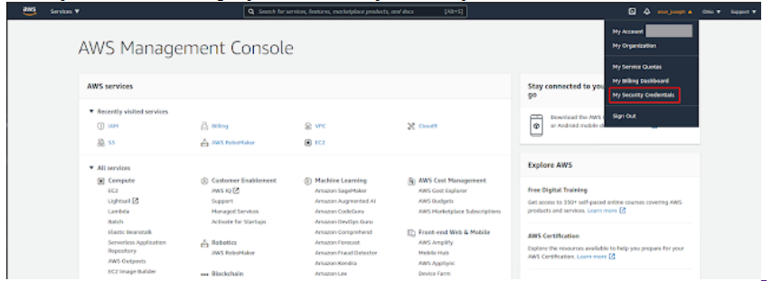

In this post, we will look at how to set up command line interface (CLI) in your local machine to access AWS services. By end of this post, you will get to know about  how to:

* Install AWS CLI version 2 in local machine
* Configure AWS CLI
* Create an S3 bucket and transfer files from your local machine to AWS S3 bucket using CLI

Let's get started!

AWS (Amazon Web Service) is an on-demand cloud platform which provides various services to individuals and companies. There are several machine learning and AI services provided by AWS. Some of them are: AWS Sagemaker, AWS Comprehend, AWS Lex etc.

Will it not be a cool idea to access such resources and services via your local machine command line interface?. This post is all about setting up your local machine CLI to access AWS services. 

# Install AWS CLI

To get started with AWS services, first you need to create an account with AWS (obvious isn't it?). The process is pretty straight forward. If you are new to AWS, then you may be eligible for 12 months free tier account. [Register your free-tier account](https://aws.amazon.com/free/?all-free-tier.sort-by=item.additionalFields.SortRank&all-free-tier.sort-order=asc).

Once you have created an account, it's time to install AWS CLI in your computer. This blog will show the steps to install latest CLI version  (version 2) in Ubuntu v20.04 (just because I am using it). If you are using other operating system, you can find the details [here](https://docs.aws.amazon.com/cli/latest/userguide/install-cliv2.html). 

Open your command terminal (Ctrl+Alt+T) and type the below commands one after the other.

To check the path and version of the AWS CLI intsalled, type: 

## Configure AWS CLI

Next, we have to configure our newly installed AWS CLI with your account. To do so, we need few details beforehand. Open [Amazon AWS](https://aws.amazon.com/) in your preferred browser and login to the console through your account. From the top right-hand dropdown (where your name is displayed), click 'My Security Credentials'.

Once you are inside security credentials page, click the button "Create New Access Key" and download the key. The download file will contain your unique 'AWSAccessKeyId' and 'AWSSecretKey'.

Coming back to our local machine command line (Ctrl+Alt+T), type `aws configure`.

This will be followed by computer asking for user inputs as shown below:

Enter your unique key id and secret key received from 'rootkey.csv' file. The default region code can be accessed from your AWS console as shown below. My default area is Ohio for which the code is 'us-east-2'. Make sure to enter your region code.

The output format specifies how the results are formatted. The default value is json. The other options are yaml, yaml-stream, text, table. More information about output format can be found [here](https://docs.aws.amazon.com/cli/latest/userguide/cli-configure-quickstart.html#cli-configure-quickstart-format). That's it!. We are all set to go ahead and create an S3 bucket using CLI in our next step.

## Create a S3 bucket and transfer file

S3 is the public cloud storage available in Amazon AWS services where you can store your data. S3 stands for 'Simple Storage Service'. The speciality of S3 is that it is designed for 99.999999999% of durability and can store millions of applications. More info about this can be found from [AWS documentation](https://aws.amazon.com/s3/). 

Let us create an S3 bucket named "01mlbucket". Type the below command:

`aws s3 mb s3://01mlbucket make_bucket: 01mlbucket`

To verify the creation of the S3 bucket, let us have a look at our AWS console. Type 'S3' in search area and select S3. There you go -> You see a newly created bucket with name "01mlbucket".

You can view the list of S3 buckets in CLI using command:

`aws s3 ls`

Now let us try to transfer a file (demo.txt) from local machine to the newly created S3 bucket using CLI. The general syntax is :

`aws s3 cp <path to file in local machine> <path to s3 bucket>`

If you want to copy all the files in a folder to your S3 bucket then the syntax would be:

`aws s3 cp <path to file in local machine> <path to s3 bucket> --recursive`

For the purpose of verification, we will login to AWS console to check for the files copied. Below is a snapshot from my console.

Hurray!. We copied all the files successfully to S3 buckesct via command line from my local machine.

## What's next?

In the future post, we will look at various machine learning services provided by Amazon AWS, and how to access those services via CLI. Stay tuned!

Have you got any questions or feedback? I would love to hear from you.
