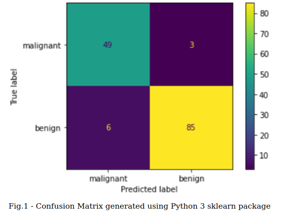
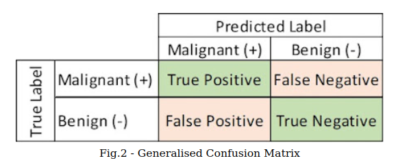

In this post, you will get hold of a strong foundation to understand the different metrics used to evaluate classification problems in machine learning --> **Confusion Matrix**. If you want to know what does it mean by a classification problem in machine learning, please visit my previous blog [Machine Learning Algorithms](https://arungrace88.github.io/Machine-Learning-Algorithms/).

It is very common and important to test any product before being launched into the market. It enables the manufacturer to claim certain quality of the products with much confidence. Also, it ensures the customer that they have paid for something which is valuable and worthy. For example, a car manufacturer may perform several automotive tests such as vibration test, emission test, pressure impulse test etc, to ensure the car meets the required standards, prevent lawsuits, give the product a marketing edge, etc.. 

In a similar way, machine learning (ML) models are also not exempted from the testing or evaluation either!. Though evaluation of ML models may or may not have a legal binding as of now, evaluating ensures a realiable and functioning model. Depending on the type of problem, the quality of ML models can be evaluated and expressed using a parameter, generally known as performance metric. Some of the performance metrics commonly used are:

* Classification metrics - Accuracy, Precision, Recall, F1-score, ROC, AUC
* Regression metrics -  Mean Square Error, Mean Absolute Error
* Computer Vision metrics - Intersection over Union (IoU), Structural Similarity Index (SSIM)
* NLP metrics -  BiLingual Evaluation Understudy Score (BLEU score), Perplexity

We will look at all these metrics in detail in the coming posts. In this post, we will look at confusion matrix, which is not a metric as such but a forerunner to a better understanding of classification metrics. Let's get started..!

# Confusion Matrix

Confusion matrix is a precursor to any kind of classification metrics. It is a table which depicts the prediction of ML model (predicted labels) against true labels. Usually, each row of confusion matrix represents instances of actual class (a.k.a true label) and each column represents instances of predicted class. However, it could also be presented in other way around where each row of confusion matrix represents intsances of predicted class and each column represents instances of actual class. 

The Fig.1 shows an example of a confusion matrix used to evaluate the quality of output of a binary classifier on the [breast cancer dataset](https://archive.ics.uci.edu/ml/datasets/Breast+Cancer+Wisconsin+(Diagnostic)). 

The diagonal elements (from top-left to bottom-right direction) represents the number of points for which predicted label is equal to the true label. The off-diagonal elements represent the number of points misclassified by the classifier. The higher the values of the diagonal elements, the better the classifier, signposting correct predictions.

## What do we know?

From the confusion matrix in the Fig.1, below observations can be made:

- There are a total of 143 data instances - (49+3+6+85)
- Out of 143 data instances, 52 (49+3) instances belong to 'malignant' class and 91 (85+6) instances belong to 'beningn' class
- Out of 52 malignant instances, the classifier predicted 49 of them correctly and misclassified 3 of them (classified as 'benign'). If we consider 'malignant' class as positive and 'benign' class as negative, then the 49 instances are called 'True Positive' and the misclassified 3 instances are called 'False Negative'.
- Out of 91 benign instances, the classifier predicted 85 of them correctly and misclassified 6 of them (classified as 'malignant'). Then the 85 instances are called 'True Negative' and the 6 instances are called 'False Positive'.

To generalise, a 2X2 confusion matrix can be tabulated as shown below in Fig.2.

## Summary

In this post, we discussed about the relevance of evaluating any machine learning model and the different metrics in a nutshell. Also, we had a detailed study on confusion matrix which is a precursor to classification metrics. Now that we have better understanding of confusion matrix, we can delve more into **classification metrics**. More about those in the next post. 

Have you got any questions? Please do get in touch with me via LinkedIn. 
