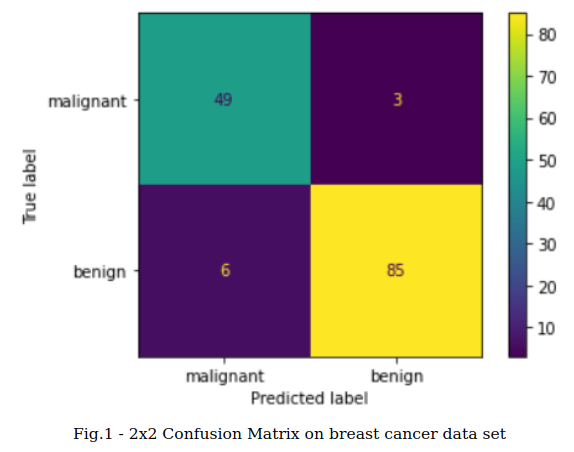
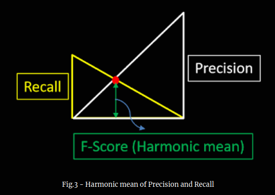
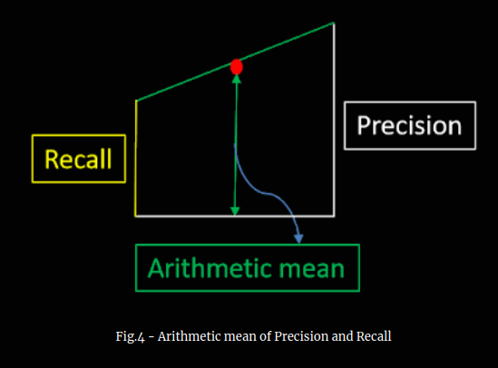

(Photo by Annie Spratt on Unsplash)

In this post, we will look at different performance metrics used to evaluate classification problems in machine learning, generally termed as 'Classification metrics', and their practical applications.
<ol>
  <li>Accuracy</li>
  <li>Precision</li>
  <li>Recall (a.k.a sensitivity or true positive rate)</li>
  <li>F-Score</li>
  <li>ROC Curve (in Part 2)</li>
  <li>AUC (in Part 2)</li>
</ol> 

For the sake of concise reading, I have split the discussion on classification metrics in two parts. In this part (Part 1) we will discuss metrics labelled from 1-4. The metric no.5 and 6 will be discussed in Part 2 of this blog.

It is assumed that by this time you have a clear understanding of confusion matrix, which is crucial to understand classification metrics. If you are not sure about the confusion matrix, then I'd suggest you to read the previous blog [Confusion Matrix - Is it really confusing?](https://arungrace88.github.io/Confusion-Matrix/).

For the sake of clarity, throughout this article, I will be referring to a 2x2 confusion matrix used to evaluate the quality of output of a binary classifier on the [breast cancer data set](https://scikit-learn.org/stable/modules/generated/sklearn.datasets.load_breast_cancer.html) as shown in Figure 1. Refer to Github for the [Python source code](https://github.com/arungrace88/AI_Blog/tree/master/Confusion%20Matrix).

# Accuracy

Accuracy tries to answer the simple question - "How many correct predictions are made by the classifier?".

<u>Accuracy is the fraction of the total number of instances, the classifier got it right</u>. In our example, classifier predcited 49 'malignant' and 85 'benign' classes correctly. Hence accuracy of the classifier is calculated as :

Accuracy = (49+85)&divide;(49+85+6+3)

Accuracy = 0.947

Mathematically, aacuracy is defined as:

Accuracy = (TP+TN)&divide;(TP+TN+FP+FN)

where,

TP = True Positive

TN = True Negative

FP = False Positive

FN = False Negative

## Practical Application

From a practical view point, accuracy metric is used when we are working with class-balanced data set. Accuracy doesnt capture the full story when it is used on class-imbalanced data set. Class-imbalanced data set are those data set where the number of instances for each classes (eg: 'malignant' or 'benign') differ largely.

So, is there any problem if you use accuracy for a class-imbalanced (opposite of class-balanced) data set? **Yes, definitely!**. Let's assume, we had another data set which contains 100 data instances, out of which 90 instances are 'malignant' and other 10 instances are 'benign'. And, let's also assume that our classifier has no intelligence at all, i.e. no matter what, it always predicts 'malignant' class for each instance. In such case, our classifier predicts 90 'malignant' instances correctly, resulting in accuracy of 90% or 0.90 (90/100).

This leads to other classification metrics which works well on class-imbalanced data set. Let's find it out.

# Precision

Precision tries to answer the question - "How many tumors labelled by the classifier as malignant are actually malignant?".

In other words, precision is the fraction of correct positive predictions made amongst the total positive predictions made by the classifier. For instance, from figure 1 it's clear that classifier predicted 55 (49+6) instances as 'mailgnant', out of which oly 49 are actually 'malignant'. Therefore, precision for 'malignant' class is given by:

= 49&divide;55

= 0.890

Unlike accuracy score, precision is calculated for each class of the data set. Similarly, precision score for 'benign' class is given by:

= 85&divide;88

= 0.965

Our classifier has a precision score of 0.890 for 'malignant' class. This means that whenever classifier predicts 'malignant', it is correct 89% of time. Also, precision score of  0.965 for 'benign' class shows that whenever it predicts 'benign', it is correct 96.5% of the time.

Mathematically, precision is defined as:

Precision = TP&divide;(TP + FP)

## Practical Application

Precision score would be very helpful if you are building a classifier to detect videos that are safe for kids. You would probably prefer to build a model that makes sure only safe videos reaches the kid, even if it miss many good videos. There is no such hard rule to determine which metric to use, it all depends on the business requirements.

# Recall

Recall tries to answer the question - "Out of the total actual malignant tumors in the data set, how many tumors are predicted by classifier as malignant?"
 
In other words, recall is the ratio of positive predictions of a class made by the classifier to the total number of instances of the class in the data set. From figure 1, it's clear that out of 52 'mailgnant' instances in the data set, 49 of them are correctly predicted by the classifier. Hence, the recall score for 'malignant' class is claculated as:

= 49&divide;52

= 0.942

Similar to precision score, recall can be calculated for each class of the data set. Recall score for 'benign' class can be calculated as:

= 85&divide;91

= 0.934

Our classifier has a recall score of 0.942 for 'malignant' class - this means that it predicts 94.2% of all 'malignant' tumors.
Mathematically, recall is defined as:

Recall = TP&divide;(TP + FN)

Recall is also called **True Positive Rate (TPR)** or **sensitivity**. 

## Practical Application

Recall score would be ideal if you are building a classifier to detect cancerous tumor on live patients. You may not want your classifier to label a cancerous tumor (malignant) as non-cancerous (benign), even if the classifier labels a non-cancerous tumor as cancerous tumor. In such scenario, recall is our best choice.

# F-Score

What if we want a metric which is a balance betwen precision and recall? F-score come to our rescue !. F-Score combines precision and recall in a special way, and is defined as the harmonic mean of precision and recall. Harmonic mean of precision and recall is calculated as:

F-score = 2&times;( (Precision &times; Recall)&divide;(Precision + Recall) )

Before we discuss about F-score, let me show you a pictorial representation of harmonic mean as in figure 3. The vertical yellow line is the measure of recall and vertical white line measures precision. The vertical green line measures harmonic mean (HM) of precision and recall. As you can see, F-score is a nice balance between precision and recall.

What if we had taken arithmetic mean of recall and precision?. See figure 4. Arithmetic mean pull towards the extreme value (precision in this case), whereas harmonic mean is insensitive in such cases. 

Please note that it is possible to give more importance to recall over precision and vice-versa by using 'adjusted' or 'calibrated' F-score (Fβ) metric. The 'adjusted' or 'calibrated' F-score is calculated as:

Fβ = (1 + β2) &times;( (Precision &times; Recall)&divide;(β2&times;Precision + Recall) )

The F-score discussed initially can be obtained by setting β=1. Due to this reason, often the F-score calculated by setting β=1 is also called F1-score or standard F-score. If in case, you want to consider recall twice as important as precision, then you can set β=2 (F2-score). Any perfect ML model will have an F-score of 1.0.

## Practical Application

* The F-score is widely used metric in information retrieval applications such as search engines. Originally, F1-score was widely used in search engines, but these days a calibarted or adjusted F-score (Fβ) is used as it allows more control between precision and recall.
* The F-score is commonly used in natural language processing (NLP) applications such as [named-entity recognition](https://deepai.org/machine-learning-glossary-and-terms/named-entity-recognition).

## Summary

In this post, we discussed 4 different types of classification metrics used for classification problems in machine learning. More about other relevant classification metrics such as ROC curve and AUC in the next post. 

Have you got any questions or feedback? I would love to hear from you.

