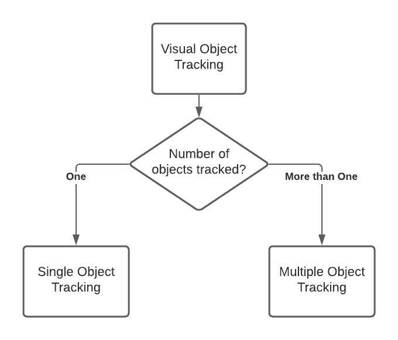

# Introduction to Visual Object Tracking (VOT)

In this article, we will look at what does it mean by Visual Object Tracking. Also, we will implement a simple visual object tracking algorithm (namely Kernelized Correlation Filter) using Python to track any random object of our choice via our computer webcam.


## Jargon Buster for Visual Object Tracking

When you dive into the field of visual object tracking, often you will across few jargons. I think it would be beneficial to define those terms at the start of the article. Below are few words:

- Sequence: A sequence is nothing but a video
- Frame:    Any sequence or video is made up of a number of images. Such an image is commonly termed as a frame. So, we can say that a sequence is made up of multiple frames.
- Tracker:  There are various algorithm developed to track an object in various frames from a sequence. When such algorithm is implemented to track any object, it is commonly referred as a 'visual object tracker'. Sometimes, the algorithm is also known by the term 'tracking algorithm'.

## Visual Object Tracking

Visual Object Tracking is a process by which an algorithm locates an object in every frame of a sequence. Depending on the number of objects tracked by the algorithm in each frame, object tracking is classified into - Single Object Tracking (SOT) annd Multiple Object Tracking (MOT). 



But how does the algorithm know which object to track?. This information is passed mainly by two ways:

- use an object detector to detect object or objects automatically from the first frame. The major downside of this approach is that whenever you need to track a different type of object/s (say, human instead of a car) you need to ensure that the object detector is trained to detect the new object type/s.
- user selects the object/s to be tracked in the first frame of the sequence. The object/s is usually selected by the user in the form of a rectangular box encompassing the target object as shown in below figure [1].


<br>

There are several state-of-the-art algorithms developed for Object Tracking. Some of them are:

- [Kernelized Correlation Filters (KCF)](https://arxiv.org/abs/1404.7584)
- [Generic Object Tracking Using Regression Networks (GOTURN)](https://arxiv.org/abs/1604.01802)
- [Multiple Instance Learning(MIL)](https://faculty.ucmerced.edu/mhyang/papers/cvpr09a.pdf)
- [Minimum Output Sum of Squared Error (MOSSE)](https://www.cs.colostate.edu/~draper/papers/bolme_cvpr10.pdf)
- [Spatio-Temporal trAnsfoRmer network for visual tracKing (STARK)](https://arxiv.org/pdf/2103.17154.pdf)


In this article, we will mainly focus on Single Object Tracking using KCF algorithm. 

## Single Object Tracking

KCF algorithm utilises the concept of correlation filter. The underlying principle is that when two samples or values are correlated then the correlation value is higher and vice-versa. This principle is extended to calculate the correlation value between the image patch containing the target object in the previous frame and the image patch from the future frame. The higher correlation value indicates the patch from the future frame where the target object is likely to be found. If you are interested to find more about KCF, it is worth to read the [original research paper from the authors of KCF](https://arxiv.org/abs/1404.7584).

Now let's implement the KCF algorithm using Python Open CV library. First, let us install the open cv library using below pip or conda command.

`pip install opencv-python`

Or

` conda install -c conda-forge opencv `

Import Open CV library

````
# Import the cv2 library
   
    import cv2

    print("The open cv version is:", cv2.__version__)

````

The output is shown as below.

`The open cv version is: 4.5.1`


### References
[1] Chen BX, Tsotsos JK. Fast visual object tracking with rotated bounding boxes. arXiv preprint arXiv:1907.03892. 2019 Jul 8

