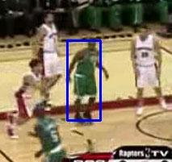

# Introduction to Visual Object Tracking (VOT)

In this article, we will look at what does it mean by Visual Object Tracking. Also, we will implement a simple visual object tracking algorithm to track any random object of our choice via our computer webcam.

## Jargon Buster for Visual Object Tracking

When you dive into the field of visual object tracking, often you will across few jargons. I think it would be beneficial to define those terms at the start of the article. Below are few words:

- Sequence: A sequence is nothing but a video
- Frame:    Any sequence or video is made up of a number of images. Such an image is commonly termed as a frame. So, we can say that a sequence is made up of multiple frames.
- Tracker:  There are various algorithm developed to track an object in various frames from a sequence. When such algorithm is implemented to track any object, it is commonly referred as a 'visual object tracker'. Sometimes, the algorithm is also known by the term 'tracking algorithm'.

## Visual Object Tracking

Visual Object Tracking is a process by which an algorithm locates an object in every frame of a sequence. But this brings us to a question - How does the algorithm know which object to track?. This information is passed mainly by two ways:

- use an object detector to detect object automatically from the first frame. The major downside of this approach is that whenever you need to track a different type of object (say, human instead of a car) you need to ensure that the object detector is trained to detect the new object type.
- user selects the object to be tracked in the first frame of the sequence. The object is usually selected by the user in the form of a rectangular box encompassing the target object as shown in below figure (blue in colour).

*Target object selected by bounding box (blue in colour)*

